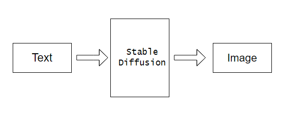
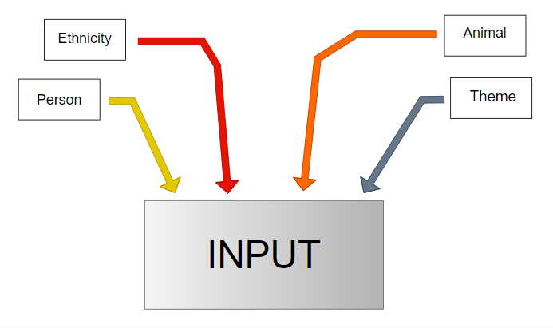
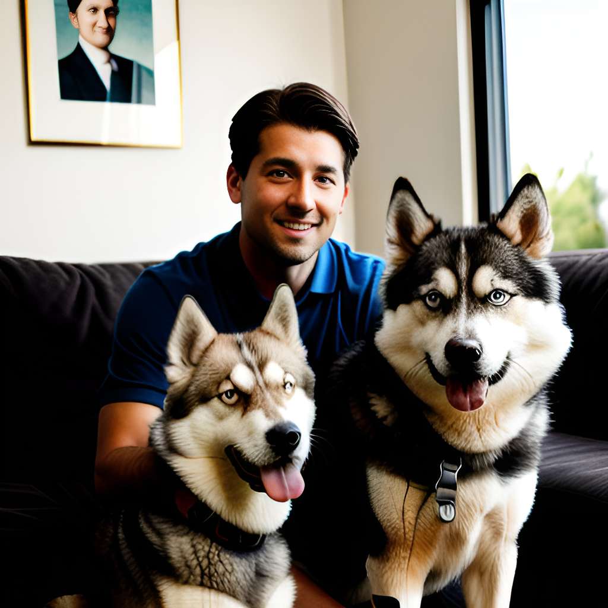
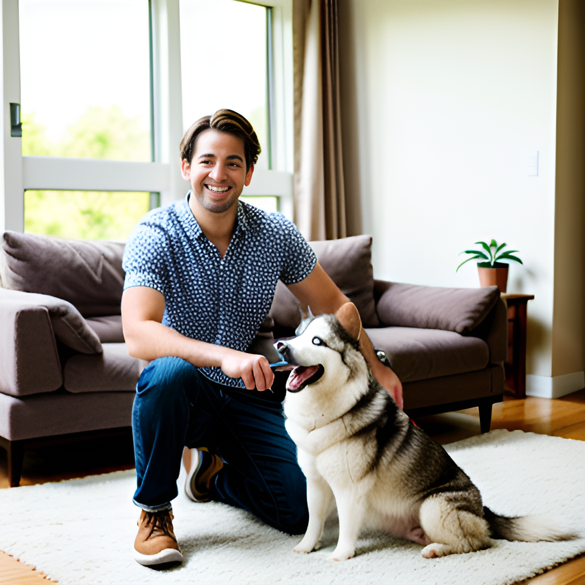
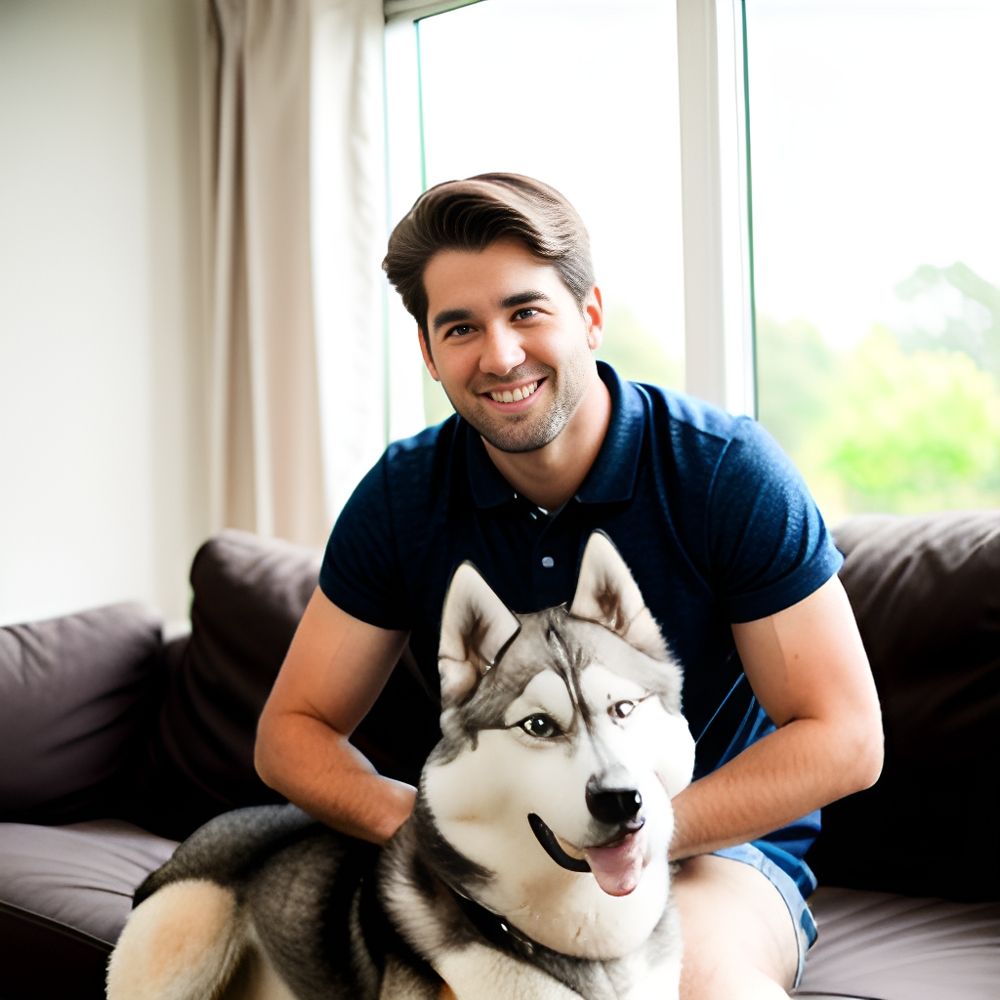
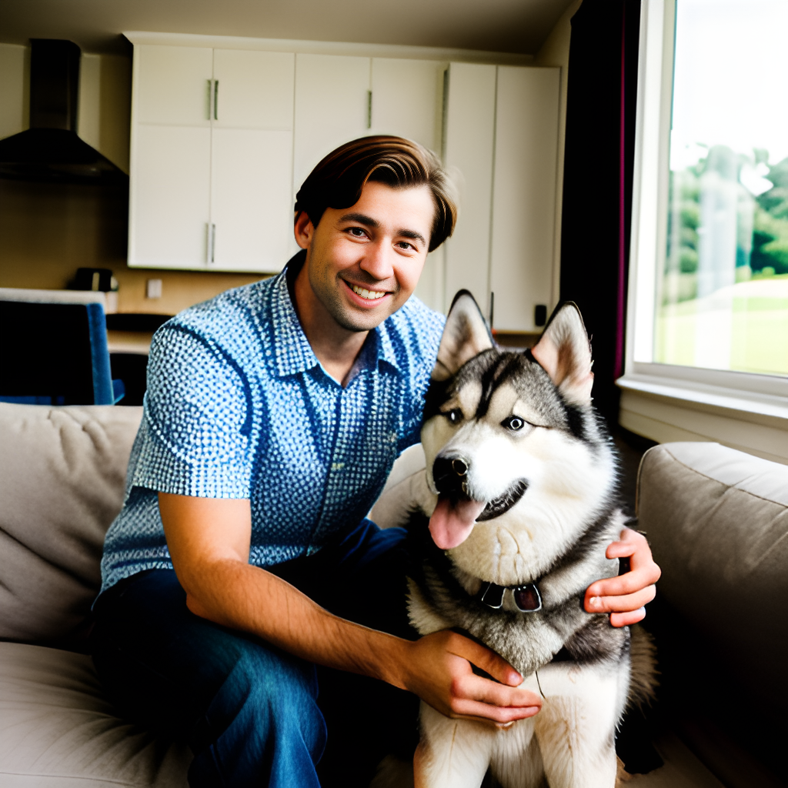
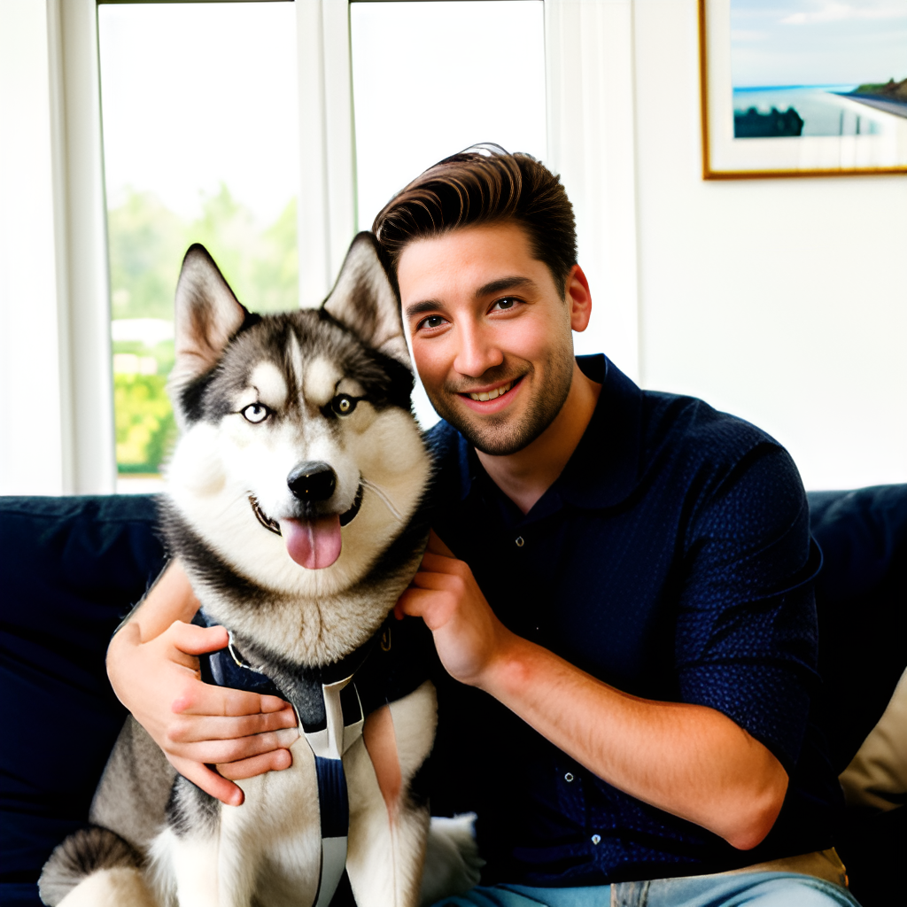

## Introduction

Objective of the Project focuses on creating an AI-driven hyper-personalization system that uses Stable Diffusion to create personalized pet images according to user-specified parameters. Users will be able to choose parameters like breed, species (dog or cat), background, and extra features, and the system will create realistic, detailed images that match these parameters. The end result will be seamlessly realistic where each generated image accurately reflects the selected characteristics, giving users personalized, AI-generated pet images.

## Approach

By using Stable Diffusion, businesses can cater to the many demands of a global population and offer a high level of hyperpersonalization for pets and their owners. In addition to increasing consumer happiness, this method produces images that are identical to the real thing.

**Architecture Diagram**

  

## Tools and Models used

Realistic_Vision_V5.1_noVAE is an advanced model designed for generating highly realistic images without relying on Variational Autoencoders (VAE). It is particularly well-suited for applications that require high fidelity and detail, such as hyperpersonalization for pets and their owners across different ethnicities.

Model takes text as input and gives out the image as output

Models used for the generating images:
    **Realistic_Vision_V5.1_noVAE**

## Tuning

To refine the output from the Realistic_Vision_V5.1_noVAE we can use:
    **loRa weights**
    **Textual Inversion**

Low-Rank Adaptation (LoRA) is a technique used to fine-tune large neural networks by introducing additional trainable parameters. LoRA allows efficient adaptation of pre-trained models to new tasks or domains without the need to retrain the entire model, making it an excellent approach for enhancing image quality.

Textual Inversion enables the model to learn and embed new concepts or terms, enhancing its ability to generate contextually accurate content based on textual inputs.

Combining LoRA (Low-Rank Adaptation) weights and Textual Inversion with the Realistic_Vision_V5.1_noVAE model can significantly enhance the hyperpersonalization of content for pets and their owners across different ethnicities. This approach leverages the strengths of both techniques to generate highly detailed and culturally relevant images.

## Results

